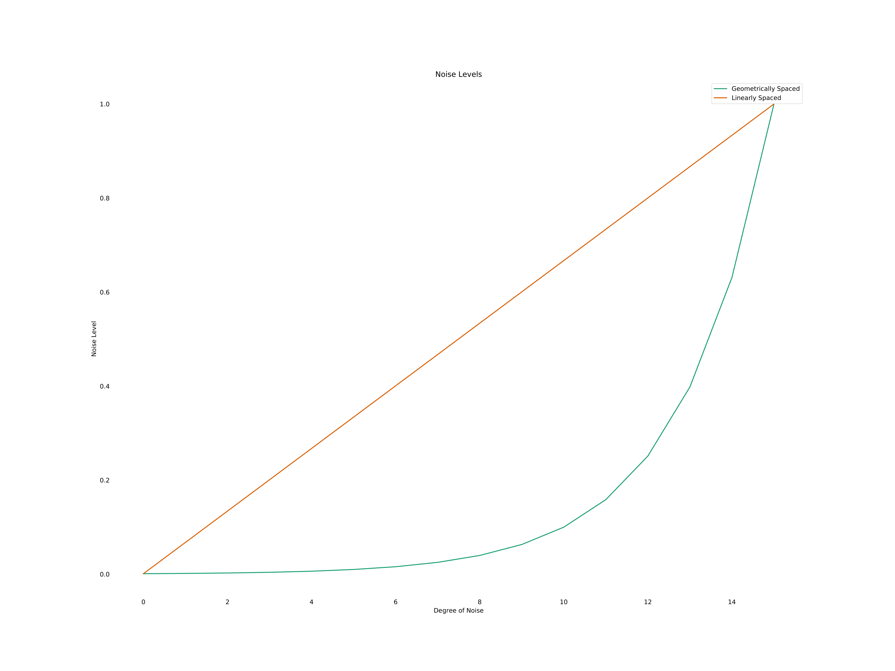
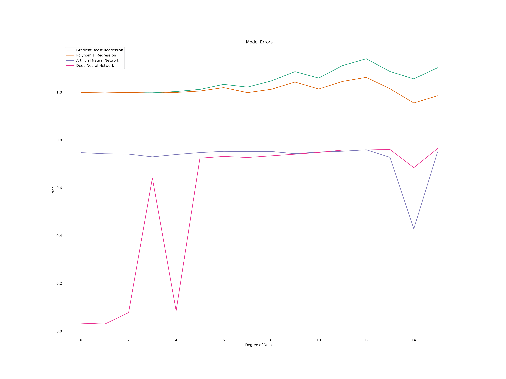

# Introduction

Noise is the reason why every desired result about nature (i.e. the environment) is not deterministically calculable. Unfortunately, we've yet to find a way to avoid it altogether; but, there exist many methods of removing noise from the observed data in order to obtain the signal of importance.

This is a study on noise and how it affects the performance of machine learning models with it's prominence in training data. First, we embark on a brief discussion on noise and it's origin; then, we consider some experimental results comparing the tolerance of noise between three different machine learning models.

# Noise Genesis

Before we define noise, let's prepare a platform off of which to jump towards the idea of noise in observation.

First, let's assume our realm of conversation consists only of an agent (e.g. an engineer, robot, self-driving car, etc.) and the environment. Perhaps this environment contains other agents, or perhaps it contains some dynamic processes which allow motion through time and space. In either case, we are only concerned with one agent within an environment.

Furthermore, let's describe an agent as an actor with a set of sensory inputs (e.g. eyes, a microphone, an infrared sensor, etc.) and a set of potential control outputs (e.g. raise arm, move forward ten meters, deploy parachute, etc.).

In order for this agent to interact with the environment, some other conditions must be met. Let's formally define an agent as follows.

An agent is an actor (e.g. human, robot, car, etc.) that possesses
- A set of sensory inputs
- A set of control outputs

Moreover, in order for agency to exist, the following conditions must hold:
1. The agent maintains an internal model<sup>1</sup> of the environment.
2. The agent has at least one method of observation.
3. The agent is able to combine environmental observations with the internal environmental model.

Since we care to analyze the effect of noise in certain outcomes, this blog post is primarily concerned with condition 2 and somewhat concerned with condition 3. As humans, our methods of observation include the systems involving our primary senses. For self-driving cars, these methods of observation may include systems which rely on cameras, LIDAR sensors, and accelerometers. In any case, agents use these methods of observation to measure certain aspects of the environment. Intuitively, the aspects which an agent measures are chosen based on learned ideas from previous observations. From this, we assume that the agent has no prior knowledge of the environment such that they have to learn it from pure observation.
        
The act of an agent observing an environmental aspect is one point of noise genesis. Due to the imprecision of known measurement methods, the observations of the agent are not precise. This lack of precision propagates into the agent's internal model of the environment, which thereby induces potentially inappropriate outputs.

Another point of noise genesis comes from bias, which is more of a structure problem than a precision problem. Bias occurs when one observation does not reflect the true nature of the global environment. For instance, birds of paradise in New Guinea<sup>2</sup> are losing their homes due to the biased observations of humans gathering food and building materials.

Why is noise a problem? Noise causes incorrect conclusions to be drawn from data. If we measure city air pollutants with imprecise instruments or in outlier areas, then the noise in the data will be reflected in the decisions made based on those results.

For this reason, it is important to combat noise to the fullest of our abilities. One source of structural noise is a disparity between the perspectives of different agents. Later in this post, we will discuss an experiment comparing a few different machine learning models and their abilities to find the signal in the noise. First, we will see how the data was generated and then briefly describe the models which were tested. Finally, we will discuss the results of the experiment.

<sup>1</sup> This usage of the term *model* is different than the common usage in machine learning. Here, it refers to a general description outlining the components of the environment and how they all work.

<sup>2</sup> I highly recommend the Netflix documentary called [Dancing With The Birds](https://www.netflix.com/title/80186796).

# Data

The data used was generated from a sine wave. A sine wave was chosen because it is a simple function that isn't a polynomial. This is an important feature of the experiment because one of our models will employ polynomials, so we don't want there to be a "competitive advantage".

Following is a brief description on how each of the sets of data were calculated.

- Training & Testing Inputs:

  $$X=\{x\in\mathbb{R}[-2\pi, 2\pi]\}$$ 

- Testing Outputs: 

  $$Y_{test}=\{\sin{x}\;|\; x\in X\}$$

- Training Outputs: 

  $$Y_{train}=\{\mathcal{N}(y, \sigma^2)\;|\; y\in Y_{test},\;\sigma^2\in\Sigma\}$$

  where $\Sigma$ is the set of all "noise levels".

In English, this means that all input values are real numbers between $-2\pi$ and $2\pi$; the testing outputs are the exact sine value, and the training outputs are samples from the normal distribution with mean equal to the exact sine value and a varying standard deviation. The standard deviation varies across what we will call *degrees of noise*, which ranges between 0.001 and 1.

The Python package `numpy` offers a few different ways we can range through the interval $[0.001, 1]$. We are interested in two of them:

- [`numpy.linspace`](https://docs.scipy.org/doc/numpy/reference/generated/numpy.linspace.html): Linear spacing means that the points that are sampled are equidistant from each other.
- [`numpy.geomspace`](https://docs.scipy.org/doc/numpy/reference/generated/numpy.geomspace.html): Geometric spacing means that the points that are sampled are equidistant from each other on a log scale.

The reason this matters is that if we use geometric (or logarithmic) spacing, then the sampled points will be concentrated in a nonlinear fashion. To illustrate this more clearly, consider the following plot:

<center>

{ width=80% }

</center>

Notice that the points sampled linearly create a straight line whereas the points sampled geometrically are concentrated more in the lower values even though they vary across the same interval. If we were concerned more about situations with less noise, perhaps the geometrically spaced samples would suit us; however, we wish to be robust and simply use the linearly spaced points.

Overall, we have two sets: training and testing. Our training set has one set of inputs and 16 sets of outputs (we experiment with 16 degrees of noise). The testing set has one set of inputs and one set of outputs. The goal is to create and test a separate model of each variety described below for each degree of noise. Then, we will compare the errors and predictions of each type of model to see how they withstand the noise that we've just generated.

# Models

We are comparing the following models to see which will be the least sensitive to noise:

- **Polynomial Regressor (PNR)** - A polynomial regressor is an extension of linear regression in that it employs higher order terms to make predictions. In particular, we'll use a tenth degree polynomial.
- **Gradient Boost Regressor (GBR)** - A gradient boost regressor is an extension of decision trees (or random forests) in that it uses gradient descent for parameter optimization.
- **Artificial Neural Network (ANN)** - Shallow neural networks can be considered as functions represented by only an input layer, an output layer, and one hidden layer between them.
- **Deep Neural Network (DNN)** - Deep neural networks are similar to shallow neural networks; they simply contain more than one hidden layer.

[Appendix A] contains the particular structures of the models that were trained. 

This group of models was chosen because it includes one model that doesn't use gradient descent, two models which are relatively small by number of parameters, and one deep neural network that is presumably the most accurate model. This mix seems to encapsulate a fair amount of the varieties of learning models that are employed. How did these models actually perform?

# Results & Discussion

Next, we want to look at the errors. Since the models we picked are rather different in the number of parameters, there will be an inherent difference in errors; although, we wish only to observe the trends with respect to one another. Therefore, they have been scaled to a standard normal distribution so that we can observe them all side-by-side.

<center>

{ width=80% }

</center>

While knowing the error rating per degree of noise is useful in giving a rating system for the models, it is still very helpful to see the prediction plots for each model. For instance, techniques like high-order Newton-Cotes interpolation operate very poorly around the edges of the interval. This is not reflected in the error, so we can use the prediction plots to see in which areas of the domain our models performed the best/worst. Moreover, we can see how these behaviors change as we introduce more and more noise into the data.

<center>

{ width=80% }

</center>

For the remainder of the blog, we will refer to each model as their abbreviated version above.

Observing the smallest degree of noise, we see that ANN and DNN have a hard time around the edges of the domain whereas GBR and PNR are nearly perfect with this small amount of noise.

As we get to the sixth degree of noise, ANN and DNN are roughly suffering the consequence of not even picking up on the curve to the far right. GBR seems to spread quite a bit around the true sine, though not straying very far from it. This seems to be a symptom of overfitting. The tenth degree PNR is still nearly perfect.

With twelve degrees of noise, GBR overfits even more and has large error near the boundaries. The neural networks maintain their large error in the large positives and DNN seems to be overfitting a small amount as well. PNR remains the best model, but is starting to suffer near the boundaries.

These trends continue into the highest levels of noise as all models lose accuracy, usually first around the boundaries. The neural networks sustained their "flatness" in the large positives throughout all levels of noise while also feeling the effects of overfitting. GBR started overfitting very quickly, but interestingly maintained the general shape of a sine wave throughout all of the noise, which is indicative of some success. PNR loses it's shape slightly in the highest levels of noise.

# Conclusion

We tested four models against sixteen different degrees of noise and found that GBR and PNR performed the best for our test case. It should be considered, however, that we picked a very particular problem that is unusual in the real world. The entire experiment was completely artificial on purpose because it is a first step towards a more rigorous study of machine learning methods and away from empirical experiments containing unintended, unnoticed, or uncontrolled bias in the data used. Of course, we want to use real-world data in the end, but we should study the algorithms themselves to learn where they will be the most effective.

There are many methods to preprocess data to sift the noise before modeling, none of which we used here. This post was focused mainly on how different types of machine learning algorithms withstand the burden of noise. There are techniques to filter data in nearly every stage of the data science process. We have only observed the capabilities of models in handling the noise themselves. In reality, much more data cleaning and preprocessing would have occured, but much of that was omitted due to the nature of the experiment.

Going forward, we can look at other filtering methods that are not embedded directly into the model itself. Also, a wider range of models and model sizes should be tested. There is even potential for a search problem in finding the best combination of noise reduction techniques using a machine learning model. However, this blog is a good start and poses a platform on which to build even deeper ideas about dealing with noise in data. We have simply withstood it, but in the future we wish to reduce it before it even reaches the models.

# References

[1] [Organism Fact Sheet: Birds of Paradise](https://www.famsf.org/files/Fact%20Sheet_%20birds_of_paradise.pdf)

# Appendix A

This section contains the structures for the models used in the study.

```
Artificial Neural Network
Model: "model_1"
_________________________________________________________________
Layer (type)                 Output Shape              Param #   
=================================================================
input_1 (InputLayer)         (None, 1)                 0         
_________________________________________________________________
dense_1 (Dense)              (None, 1024)              2048      
_________________________________________________________________
dense_2 (Dense)              (None, 1)                 1025      
=================================================================
Total params: 3,073
Trainable params: 3,073
Non-trainable params: 0
_________________________________________________________________

Deep Neural Network
Model: "model_2"
_________________________________________________________________
Layer (type)                 Output Shape              Param #   
=================================================================
input_2 (InputLayer)         (None, 1)                 0         
_________________________________________________________________
dense_3 (Dense)              (None, 1024)              2048      
_________________________________________________________________
dense_4 (Dense)              (None, 1024)              1049600   
_________________________________________________________________
dense_5 (Dense)              (None, 1024)              1049600   
_________________________________________________________________
dense_6 (Dense)              (None, 1)                 1025      
=================================================================
Total params: 2,102,273
Trainable params: 2,102,273
Non-trainable params: 0
_________________________________________________________________

Gradient Boost Regressor
{
  "alpha": 0.9,
  "criterion": "friedman_mse",
  "init": null,
  "learning_rate": 0.1,
  "loss": "ls",
  "max_depth": 5,
  "max_features": null,
  "max_leaf_nodes": null,
  "min_impurity_decrease": 0.0,
  "min_impurity_split": null,
  "min_samples_leaf": 1,
  "min_samples_split": 2,
  "min_weight_fraction_leaf": 0.0,
  "n_estimators": 100,
  "n_iter_no_change": null,
  "presort": "auto",
  "random_state": null,
  "subsample": 1.0,
  "tol": 0.0001,
  "validation_fraction": 0.3,
  "verbose": 1,
  "warm_start": false
}

Polynomial Regressor (degree: 10)
{
  "copy_X": true,
  "fit_intercept": true,
  "n_jobs": null,
  "normalize": false
}
```

# Appendix Before

The code for this project and all files included can be found here: https://github.com/austindkoenig/Noise-Analysis